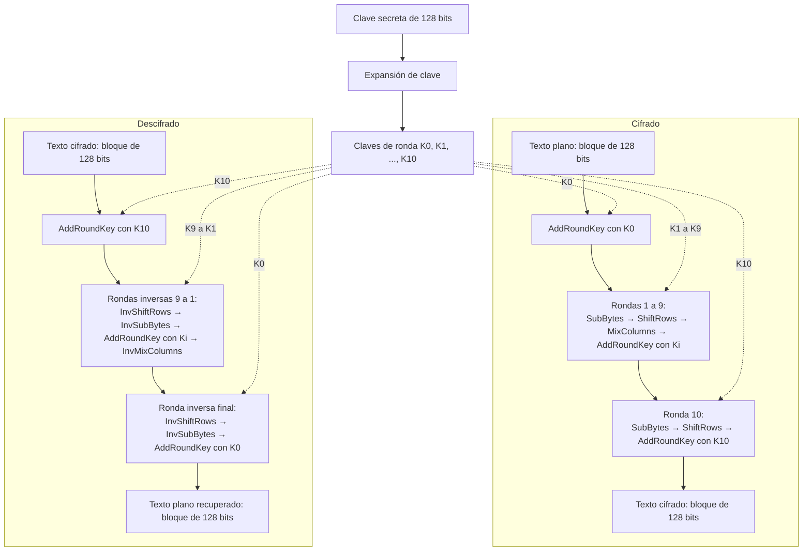

# AES (Advanced Encryption Standard)

## ¿Qué es AES?

El **Estándar de Cifrado Avanzado** (*Advanced Encryption Standard*, AES) es un algoritmo criptográfico simétrico de bloques. Se denomina simétrico porque utiliza la misma clave secreta para cifrar y descifrar la información. El cifrado transforma el texto plano en texto cifrado, aparentemente ininteligible; el descifrado aplica las transformaciones inversas con la clave correcta para recuperar el texto original.

AES se basa en el algoritmo Rijndael, diseñado por Joan Daemen y Vincent Rijmen, y fue adoptado como estándar por el Instituto Nacional de Estándares y Tecnología de Estados Unidos (NIST). El estándar define tres variantes: AES-128, AES-192 y AES-256. Todas procesan bloques de **128 bits (16 bytes)**; lo que cambia es el tamaño de la clave y, en consecuencia, el número de rondas (National Institute of Standards and Technology [NIST], 2023).

| Variante | Tamaño de la clave | Tamaño del bloque | Número de rondas |
|---|---:|---:|---:|
| AES-128 | 128 bits (16 bytes) | 128 bits (16 bytes) | 10 |
| AES-192 | 192 bits (24 bytes) | 128 bits (16 bytes) | 12 |
| AES-256 | 256 bits (32 bytes) | 128 bits (16 bytes) | 14 |

## a) Campos de aplicación y ejemplos actuales de uso

### 1. Comunicaciones web seguras

AES se utiliza para proteger datos que viajan por Internet. Por ejemplo, TLS 1.3 —protocolo empleado por HTTPS— define conjuntos criptográficos como `TLS_AES_128_GCM_SHA256` y `TLS_AES_256_GCM_SHA384`. En estos casos, AES funciona en modo GCM para aportar confidencialidad y autenticación a los registros transmitidos (Rescorla, 2018).

### 2. Redes privadas virtuales (VPN)

Las VPN pueden utilizar IPsec para crear un túnel seguro entre equipos o redes. El mecanismo AES-GCM para IPsec ESP cifra el tráfico y también permite comprobar su autenticidad e integridad, con implementaciones eficientes tanto en software como en hardware (Viega & McGrew, 2005).

### 3. Cifrado de discos y otros dispositivos de almacenamiento

AES también protege datos en reposo, como archivos almacenados en discos. El modo XTS-AES fue aprobado por el NIST específicamente como una opción para mantener la confidencialidad de la información contenida en dispositivos de almacenamiento (Dworkin, 2010). Debe señalarse que XTS por sí solo no autentica los datos ni su origen.

Otros campos comunes incluyen redes inalámbricas, servicios en la nube, copias de seguridad, gestores de contraseñas y ciertas aplicaciones de mensajería. Sin embargo, que una aplicación pertenezca a una de estas categorías no significa automáticamente que use AES: esto depende de su protocolo y de su implementación concreta.

## b) Cifrado y descifrado de un texto con AES-128

### Preparación del texto y de la clave

Para cifrar un texto primero se representa como bytes, por ejemplo mediante UTF-8. AES solo transforma bloques individuales de 16 bytes, por lo que un mensaje de mayor longitud debe dividirse y procesarse mediante un **modo de operación**. Según el modo elegido, también puede ser necesario completar el último bloque (*padding*) y utilizar un vector de inicialización o *nonce*.

En una aplicación real suele preferirse un modo autenticado, como AES-GCM, porque además de ocultar el contenido permite detectar modificaciones. El modo, el *nonce*, la autenticación y el posible relleno no forman parte de la transformación interna de AES descrita en FIPS 197, sino de la forma segura de emplearla.

Para **AES-128** se necesita:

- Una clave secreta de **128 bits**, equivalente a 16 bytes.
- Bloques de entrada de **128 bits**, también equivalentes a 16 bytes.
- **10 rondas** de transformación.
- Once claves de ronda: una para la transformación inicial y una para cada ronda.

### Expansión de la clave

Antes de procesar el bloque, AES-128 aplica el algoritmo de expansión de clave (*KeyExpansion*) a la clave original. Así genera once claves de ronda de 128 bits, identificadas como `K0`, `K1`, ..., `K10`. Estas no son once contraseñas independientes: todas se derivan de la misma clave secreta. Durante el cifrado se usan desde `K0` hasta `K10`, mientras que durante el descifrado se recorren en sentido contrario.

### Representación del bloque

Los 16 bytes del bloque se organizan en una matriz de 4 × 4 bytes denominada **estado** (*state*). Las transformaciones de AES modifican sucesivamente esta matriz.

### Principales transformaciones

1. **SubBytes (sustitución de bytes).** Cada byte del estado se reemplaza por otro utilizando una tabla de sustitución no lineal llamada S-box. Su operación inversa es **InvSubBytes**, que emplea la S-box inversa.

2. **ShiftRows (desplazamiento de filas).** Las filas de la matriz se rotan cíclicamente hacia la izquierda: la primera no se desplaza y las siguientes se desplazan uno, dos y tres bytes. **InvShiftRows** efectúa los desplazamientos hacia la derecha.

3. **MixColumns (mezcla de columnas).** Cada columna se transforma mediante operaciones matemáticas en el campo finito GF(2⁸). Esto difunde la influencia de cada byte sobre los demás. **InvMixColumns** revierte la transformación. La última ronda de AES no incluye esta operación.

4. **AddRoundKey (adición de la clave de ronda).** Se aplica una operación XOR entre el estado y la clave correspondiente a la ronda. Es la transformación en la que la clave interviene directamente. Su inversa es la misma operación, pues aplicar dos veces XOR con el mismo valor recupera el dato original.

### Pasos del cifrado con AES-128

1. Se codifica el texto como bytes y se prepara un bloque de 16 bytes de acuerdo con el modo de operación elegido.
2. Los bytes se colocan en la matriz de estado.
3. Se expanden los 16 bytes de la clave para obtener `K0` a `K10`.
4. **Ronda inicial:** se ejecuta `AddRoundKey` con `K0`.
5. **Rondas 1 a 9:** en cada ronda se ejecutan, en este orden, `SubBytes`, `ShiftRows`, `MixColumns` y `AddRoundKey` con `Ki`.
6. **Ronda 10:** se ejecutan `SubBytes`, `ShiftRows` y `AddRoundKey` con `K10`. Se omite `MixColumns`.
7. El estado resultante constituye el bloque cifrado de 128 bits.

### Pasos del descifrado con AES-128

1. Se recibe un bloque cifrado de 16 bytes y se organiza como matriz de estado.
2. A partir de la misma clave secreta se obtienen nuevamente `K0` a `K10`.
3. **Paso inicial:** se ejecuta `AddRoundKey` con `K10`.
4. **Rondas inversas 9 a 1:** se ejecutan, en este orden, `InvShiftRows`, `InvSubBytes`, `AddRoundKey` con `Ki` e `InvMixColumns`.
5. **Ronda inversa final:** se ejecutan `InvShiftRows`, `InvSubBytes` y `AddRoundKey` con `K0`. Se omite `InvMixColumns`.
6. Se recuperan los bytes del texto plano y se revierten, cuando corresponda, el modo de operación y el relleno. Finalmente, los bytes se interpretan con la codificación original, por ejemplo UTF-8.

Sin la clave correcta no se generan las mismas claves de ronda y, por tanto, no se recupera el texto original.

## c) Diagrama de flujo de AES-128

El diagrama muestra que ambos procesos parten de la **misma clave secreta**. La expansión produce las mismas once claves de ronda; el cifrado las consume en orden ascendente (`K0` a `K10`) y el descifrado en orden descendente (`K10` a `K0`).

## Referencias

Dworkin, M. (2010). *Recommendation for block cipher modes of operation: The XTS-AES mode for confidentiality on storage devices* (NIST Special Publication 800-38E). National Institute of Standards and Technology. https://doi.org/10.6028/NIST.SP.800-38E

National Institute of Standards and Technology. (2023). *Advanced Encryption Standard (AES)* (Federal Information Processing Standards Publication 197, Update 1). U.S. Department of Commerce. https://doi.org/10.6028/NIST.FIPS.197-upd1

Panda Security. (s. f.). *¿Qué es el cifrado AES?* https://www.pandasecurity.com/es/mediacenter/cifrado-aes-guia/

Rescorla, E. (2018). *The Transport Layer Security (TLS) protocol version 1.3* (RFC 8446). Internet Engineering Task Force. https://doi.org/10.17487/RFC8446

Viega, J., & McGrew, D. (2005). *The use of Galois/Counter Mode (GCM) in IPsec Encapsulating Security Payload (ESP)* (RFC 4106). Internet Engineering Task Force. https://doi.org/10.17487/RFC4106

Whitestack. (2024, 9 de agosto). *¿Cómo funciona el cifrado AES? Funcionamiento y características*. https://whitestack.com/es/blog/cifrado-aes/
