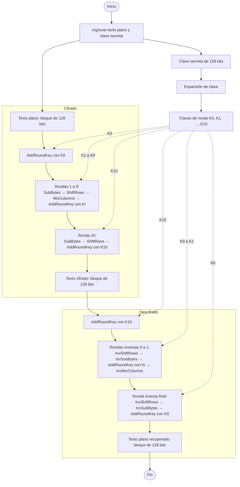

# AES (Advanced Encryption Standard)

## Integrantes

- Sebastian Garcia — 22291
- Ana Laura Tschen — 221645
- Juan Francisco — 23617

## ¿Qué es AES?

El **Estándar de Cifrado Avanzado** (*Advanced Encryption Standard*, AES) es un algoritmo criptográfico simétrico de bloques. Se denomina simétrico porque utiliza la misma clave secreta para cifrar y descifrar la información. El cifrado transforma el texto plano en texto cifrado, aparentemente ininteligible; el descifrado aplica las transformaciones inversas con la clave correcta para recuperar el texto original.

AES se basa en el algoritmo Rijndael, diseñado por Joan Daemen y Vincent Rijmen, y fue adoptado como estándar por el Instituto Nacional de Estándares y Tecnología de Estados Unidos (NIST). El estándar define tres variantes: AES-128, AES-192 y AES-256. Todas procesan bloques de **128 bits (16 bytes)**; lo que cambia es el tamaño de la clave y, en consecuencia, el número de rondas (National Institute of Standards and Technology [NIST], 2023).

| Variante | Tamaño de la clave | Tamaño del bloque | Número de rondas |
|---|---:|---:|---:|
| AES-128 | 128 bits (16 bytes) | 128 bits (16 bytes) | 10 |
| AES-192 | 192 bits (24 bytes) | 128 bits (16 bytes) | 12 |
| AES-256 | 256 bits (32 bytes) | 128 bits (16 bytes) | 14 |

## a) Campos de aplicación y ejemplos actuales de uso

### 1. Comunicaciones web seguras

AES se utiliza para proteger datos que viajan por Internet. Por ejemplo, TLS 1.3 —protocolo empleado por HTTPS— define conjuntos criptográficos como `TLS_AES_128_GCM_SHA256` y `TLS_AES_256_GCM_SHA384`. En estos casos, AES funciona en modo GCM para aportar confidencialidad y autenticación a los registros transmitidos (Rescorla, 2018).

### 2. Redes privadas virtuales (VPN)

Las VPN pueden utilizar IPsec para crear un túnel seguro entre equipos o redes. El mecanismo AES-GCM para IPsec ESP cifra el tráfico y también permite comprobar su autenticidad e integridad, con implementaciones eficientes tanto en software como en hardware (Viega & McGrew, 2005).

### 3. Cifrado de discos y otros dispositivos de almacenamiento

AES también protege datos en reposo, como archivos almacenados en discos. El modo XTS-AES fue aprobado por el NIST específicamente como una opción para mantener la confidencialidad de la información contenida en dispositivos de almacenamiento (Dworkin, 2010). Debe señalarse que XTS por sí solo no autentica los datos ni su origen.

Otros campos comunes incluyen redes inalámbricas, servicios en la nube, copias de seguridad, gestores de contraseñas y ciertas aplicaciones de mensajería. Sin embargo, que una aplicación pertenezca a una de estas categorías no significa automáticamente que use AES: esto depende de su protocolo y de su implementación concreta.

## b) Cifrado y descifrado de un texto con AES-128

### Preparación del texto y de la clave

Para cifrar un texto primero se representa como bytes, por ejemplo mediante UTF-8. AES solo transforma bloques individuales de 16 bytes, por lo que un mensaje de mayor longitud debe dividirse y procesarse mediante un **modo de operación**. Según el modo elegido, también puede ser necesario completar el último bloque (*padding*) y utilizar un vector de inicialización o *nonce*.

En una aplicación real suele preferirse un modo autenticado, como AES-GCM, porque además de ocultar el contenido permite detectar modificaciones. El modo, el *nonce*, la autenticación y el posible relleno no forman parte de la transformación interna de AES descrita en FIPS 197, sino de la forma segura de emplearla.

Para **AES-128** se necesita:

- Una clave secreta de **128 bits**, equivalente a 16 bytes.
- Bloques de entrada de **128 bits**, también equivalentes a 16 bytes.
- **10 rondas** de transformación.
- Once claves de ronda: una para la transformación inicial y una para cada ronda.

### Expansión de la clave

Antes de procesar el bloque, AES-128 aplica el algoritmo de expansión de clave (*KeyExpansion*) a la clave original. Así genera once claves de ronda de 128 bits, identificadas como `K0`, `K1`, ..., `K10`. Estas no son once contraseñas independientes: todas se derivan de la misma clave secreta. Durante el cifrado se usan desde `K0` hasta `K10`, mientras que durante el descifrado se recorren en sentido contrario.

### Representación del bloque

Los 16 bytes del bloque se organizan en una matriz de 4 × 4 bytes denominada **estado** (*state*). Las transformaciones de AES modifican sucesivamente esta matriz.

### Principales transformaciones

1. **SubBytes (sustitución de bytes).** Cada byte del estado se reemplaza por otro utilizando una tabla de sustitución no lineal llamada S-box. Su operación inversa es **InvSubBytes**, que emplea la S-box inversa.

2. **ShiftRows (desplazamiento de filas).** Las filas de la matriz se rotan cíclicamente hacia la izquierda: la primera no se desplaza y las siguientes se desplazan uno, dos y tres bytes. **InvShiftRows** efectúa los desplazamientos hacia la derecha.

3. **MixColumns (mezcla de columnas).** Cada columna se transforma mediante operaciones matemáticas en el campo finito GF(2⁸). Esto difunde la influencia de cada byte sobre los demás. **InvMixColumns** revierte la transformación. La última ronda de AES no incluye esta operación.

4. **AddRoundKey (adición de la clave de ronda).** Se aplica una operación XOR entre el estado y la clave correspondiente a la ronda. Es la transformación en la que la clave interviene directamente. Su inversa es la misma operación, pues aplicar dos veces XOR con el mismo valor recupera el dato original.

### Pasos del cifrado con AES-128

1. Se codifica el texto como bytes y se prepara un bloque de 16 bytes de acuerdo con el modo de operación elegido.
2. Los bytes se colocan en la matriz de estado.
3. Se expanden los 16 bytes de la clave para obtener `K0` a `K10`.
4. **Ronda inicial:** se ejecuta `AddRoundKey` con `K0`.
5. **Rondas 1 a 9:** en cada ronda se ejecutan, en este orden, `SubBytes`, `ShiftRows`, `MixColumns` y `AddRoundKey` con `Ki`.
6. **Ronda 10:** se ejecutan `SubBytes`, `ShiftRows` y `AddRoundKey` con `K10`. Se omite `MixColumns`.
7. El estado resultante constituye el bloque cifrado de 128 bits.

### Pasos del descifrado con AES-128

1. Se recibe un bloque cifrado de 16 bytes y se organiza como matriz de estado.
2. A partir de la misma clave secreta se obtienen nuevamente `K0` a `K10`.
3. **Paso inicial:** se ejecuta `AddRoundKey` con `K10`.
4. **Rondas inversas 9 a 1:** se ejecutan, en este orden, `InvShiftRows`, `InvSubBytes`, `AddRoundKey` con `Ki` e `InvMixColumns`.
5. **Ronda inversa final:** se ejecutan `InvShiftRows`, `InvSubBytes` y `AddRoundKey` con `K0`. Se omite `InvMixColumns`.
6. Se recuperan los bytes del texto plano y se revierten, cuando corresponda, el modo de operación y el relleno. Finalmente, los bytes se interpretan con la codificación original, por ejemplo UTF-8.

Sin la clave correcta no se generan las mismas claves de ronda y, por tanto, no se recupera el texto original.

## c) Diagrama de flujo de AES-128



El diagrama muestra que ambos procesos parten de la **misma clave secreta**. La expansión produce las mismas once claves de ronda; el cifrado las consume en orden ascendente (`K0` a `K10`) y el descifrado en orden descendente (`K10` a `K0`).

## Ejercicio 2 - Análisis del programa secuencial

Al revisar el programa `busqueda_clave_aes_secuencial.c`, vimos que sí utiliza correctamente AES-128 para este ejercicio. Según lo investigado en el [documento del NIST](https://csrc.nist.gov/pubs/fips/197/final), AES-128 usa una clave de 128 bits, que equivale a 16 bytes, y trabaja con bloques de 16 bytes.

En el programa, la clave tiene los 16 bytes necesarios. Sin embargo, para que la búsqueda se pueda realizar en poco tiempo, solo se prueban hasta 1,048,576 claves posibles. Esto hace que el ejercicio sea más sencillo, ya que probar todas las claves de AES-128 tomaría muchísimo más tiempo.

El mensaje que se cifra es “Puedes lograrlo!”, que ocupa exactamente 16 bytes. Por eso cabe en un solo bloque y no necesita agregar relleno para completar su tamaño. El programa usa el modo ECB, que cifra cada bloque por separado. En este caso se trabaja con un solo bloque, pero con mensajes más largos este modo puede mostrar patrones si hay bloques repetidos.

Primero, el programa cifra el mensaje usando la clave que corresponde al número 12345. Después, prueba claves una por una, empezando desde cero. Con cada clave intenta descifrar el mensaje y compara el resultado con el texto original. Cuando los dos mensajes coinciden, muestra la clave encontrada y termina la búsqueda.

Esto coincide con lo investigado sobre el cifrado simétrico, porque se necesita la misma clave para cifrar y recuperar el mensaje. Las operaciones de AES las realiza la biblioteca [OpenSSL](https://docs.openssl.org/3.0/man3/EVP_EncryptInit/), por lo que no aparecen escritas paso a paso en el programa.

Consideramos que el programa cumple con el objetivo del laboratorio: mostrar una búsqueda secuencial usando AES-128. Las claves fáciles de probar se usan para el ejercicio y no serían adecuadas para proteger información real.

## Compilación y ejecución

En Ubuntu o Debian, primero se actualiza la lista de paquetes y se instala lo necesario para usar OpenSSL desde C:

```bash
sudo apt update
sudo apt install libssl-dev
```

Después, desde la carpeta del proyecto, se entra a `Programas`, se compila y se ejecuta:

```bash
cd Programas
gcc -std=c11 -O2 -Wall -Wextra busqueda_clave_aes_secuencial.c -o busqueda_clave_aes_secuencial -lcrypto
./busqueda_clave_aes_secuencial
```

La prueba se realizó en Fedora, donde no está disponible el comando `apt`. Como OpenSSL ya estaba instalado con los archivos necesarios, se pudo compilar directamente sin errores ni advertencias.

## Tiempo de ejecución

El programa ya medía cuánto tardaba en buscar la clave. También se agregó una medición del tiempo total, que incluye preparar el mensaje cifrado, buscar la clave y mostrar los resultados.

Al ejecutar el programa obtuvimos lo siguiente:

```text
Clave encontrada: 12345
Mensaje: Puedes lograrlo!
Ejecucion: secuencial
Tiempo de busqueda: 0.004920 segundos
Tiempo total del programa: 0.006344 segundos
```

La búsqueda tardó aproximadamente 0.0049 segundos y el programa completo tardó aproximadamente 0.0063 segundos. Se probaron 12,346 claves, contando desde cero hasta llegar a 12345. No fue necesario probar todas las claves del ejercicio porque el programa se detuvo al encontrar la correcta. Los tiempos pueden cambiar dependiendo de la computadora y de los otros programas que estén ejecutándose.

## 3. Problemas del programa secuencial

### a) Qué encontramos

**Construcción de la clave.** El programa original forma una clave de 16 bytes a partir de un número y deja los bytes restantes en cero. La clave tiene el tamaño correcto para AES-128, pero las candidatas son fáciles de generar y pertenecen a un rango pequeño. En la versión mejorada se agregó un prefijo fijo distinto de cero. Esto cambia las claves que se prueban, pero no aumenta su seguridad ni la cantidad de posibilidades. Por eso lo llamamos prefijo fijo y no lo consideramos una mejora de seguridad.

**Modo ECB.** El mensaje ocupa un solo bloque de 16 bytes, así que ECB permite realizar esta demostración. Su limitación aparece al cifrar varios bloques: si dos bloques son iguales, producen el mismo resultado cifrado y pueden mostrar patrones. Además, este programa no comprueba si el mensaje fue modificado. Para una aplicación real propondríamos usar un modo como AES-GCM, que también permite verificar la integridad. En este laboratorio conservamos ECB para comparar las dos versiones con el mismo ejercicio.

**Verificación con el texto original.** El programa compara los 16 bytes descifrados con “Puedes lograrlo!”. Esto supone que se conoce todo el mensaje original. Es una prueba de búsqueda con texto conocido; si solo se conoce una parte del mensaje o no se conoce ninguna, la misma comparación no sirve. La clave secreta se usa para preparar el ejercicio, pero la búsqueda verifica cada candidata mediante el mensaje recuperado. Una coincidencia con un bloque tampoco garantiza matemáticamente que sea la única clave posible, aunque encontrar otra coincidencia en este rango sería muy poco probable.

**Espacio de claves.** AES-128 tiene 2¹²⁸ claves posibles, pero por defecto el programa solo explora 2²⁰, es decir, 1,048,576 candidatas. Esto representa 2⁻¹⁰⁸ del espacio completo. Incluso al configurar 63 bits seguimos buscando dentro de una parte del espacio de AES-128. Por eso encontrar la clave en el laboratorio no significa que sea práctico romper AES-128 completo.

**Posición de la clave y tiempos.** La clave original, 12345, está cerca del inicio del rango. Eso hace que la búsqueda termine pronto y que la comunicación entre procesos pueda pesar mucho en el tiempo paralelo. Para comparar las versiones mejoradas usamos por defecto una clave cerca del final. Los tiempos siguen dependiendo de la posición de la clave, del equipo y de su carga.

### b) Mejoras que hicimos

| Mejora | Por qué | Propuesta por |
| --- | --- | --- |
| Colocar la clave de prueba por defecto cerca del final del rango | Permite medir una búsqueda que recorre casi todo el rango. Ambas versiones usan la misma clave. | Ana Laura |
| Mostrar el tamaño del rango y su fracción frente a 2¹²⁸ | Aclara que solo se explora una parte pequeña de las claves de AES-128. | Sebastian |
| Separar la comparación en `keys_match()` | Hace más fácil entender dónde se comprueba el mensaje conocido. No elimina la necesidad de conocerlo. | Ana Laura |
| Configurar los bits de búsqueda desde la terminal | Permite cambiar el tamaño del ejercicio sin editar ni recompilar el código. | Cisco |
| Repartir el rango entre los procesos | Cada proceso recibe una parte distinta para realizar la búsqueda en paralelo. | Sebastian |
| Validar completamente los argumentos | Evita aceptar entradas como `4abc`, números fuera de rango o argumentos de más. La validación se comparte en `aes_busqueda_opciones.h`. | Ana Tschen |
| Permitir una clave de prueba opcional | Sirve para comprobar claves al inicio, al final o fuera del rango de búsqueda. | Sebastian García |
| Coordinar la finalización por tandas | Evita que un proceso espere un aviso que otro ya no va a recibir. Todos participan hasta encontrar la clave o agotar el rango. | Juan Francisco Martínez |

Conservamos los nombres que ya estaban indicados para las mejoras anteriores y asignamos una de las tres correcciones nuevas a cada integrante. El prefijo fijo se mantiene como parte del ejercicio, sin contarlo como mejora de seguridad. Tampoco se incluye un Makefile ni una comprobación de `malloc`, porque esos elementos no están en los archivos actuales.

## 4. Versión paralela con Open MPI

### a) Cómo repartimos el trabajo

El proceso 0 cifra el mensaje con la clave de prueba y lo comparte mediante `MPI_Bcast`. Después, el rango se divide en bloques consecutivos de tamaños casi iguales. Si el número de candidatas no se divide exactamente entre los procesos, los primeros reciben una candidata adicional. Así cada candidata pertenece a un solo proceso y no hay espacios sin asignar ni candidatas repetidas.

Por ejemplo, con 16 candidatas y 3 procesos, los rangos son:

| Proceso | Candidatas asignadas |
| --- | --- |
| 0 | 0 a 5 |
| 1 | 6 a 10 |
| 2 | 11 a 15 |

Cada proceso prueba hasta 2,048 claves por tanda. Al finalizar, todos usan `MPI_Allreduce` para compartir si encontraron una clave y si queda trabajo. Los procesos que ya agotaron su rango siguen participando en la comunicación, incluso si recibieron un rango vacío. Todos terminan cuando aparece una coincidencia o cuando se agotan las candidatas. Si se encuentra la clave antes, se deja de probar el resto del rango a propósito.

La versión anterior enviaba avisos con `MPI_Isend` y los consultaba con `MPI_Iprobe`. Se cambió ese mecanismo porque un proceso que terminara su rango podía dejar de recibir avisos mientras otro esperaba completar el envío.

### b) Compilación y ejecución

En Fedora se necesitan Open MPI y sus archivos de desarrollo:

```bash
sudo dnf install openmpi openmpi-devel
```

Desde la carpeta del proyecto, compilamos ambas versiones:

```bash
cd Programas
export PATH=/usr/lib64/openmpi/bin:$PATH
gcc -std=c11 -O2 -Wall -Wextra busqueda_clave_aes_secuencial_mejorado.c -o busqueda_clave_aes_secuencial_mejorado -lcrypto
/usr/lib64/openmpi/bin/mpicc -std=c11 -O2 -Wall -Wextra busqueda_clave_aes_paralelo.c -o busqueda_clave_aes_paralelo -lcrypto
```

En Fedora usamos la ruta de Open MPI. Si `mpicc` y `mpirun` ya están disponibles directamente en la terminal, se pueden usar sin esa ruta. El archivo `aes_busqueda_opciones.h` debe estar junto a los dos programas.

Para comparar el mismo rango de 20 bits:

```bash
./busqueda_clave_aes_secuencial_mejorado 20
/usr/lib64/openmpi/bin/mpirun -np 2 ./busqueda_clave_aes_paralelo 20
/usr/lib64/openmpi/bin/mpirun -np 3 ./busqueda_clave_aes_paralelo 20
/usr/lib64/openmpi/bin/mpirun -np 4 ./busqueda_clave_aes_paralelo 20
```

### c) Verificación de la clave y el mensaje

Ambas versiones compilaron sin advertencias. La secuencial y la paralela con 2, 3 y 4 procesos recuperaron la misma clave y mensaje en las tres ejecuciones de cada configuración con 20 bits:

```text
Clave encontrada: 1048539
Mensaje: Puedes lograrlo!
```

Las pruebas adicionales dieron estos resultados:

| Bits de búsqueda | Clave de prueba | Resultado en ambas versiones |
| --- | --- | --- |
| 1 | 1, por defecto | Clave encontrada: 1 |
| 4 | 0 | Clave encontrada: 0 |
| 4 | 15 | Clave encontrada: 15 |
| 4 | 16 | No se encontró la clave, porque queda fuera del rango |

También se comprobó que se rechazan argumentos inválidos como `4abc`, `0`, `64`, una clave negativa, una clave demasiado grande y argumentos adicionales.

Para repetir los casos en paralelo, incluyendo uno con más procesos que candidatas:

```bash
/usr/lib64/openmpi/bin/mpirun -np 4 ./busqueda_clave_aes_paralelo 1
/usr/lib64/openmpi/bin/mpirun -np 3 ./busqueda_clave_aes_paralelo 4 0
/usr/lib64/openmpi/bin/mpirun -np 3 ./busqueda_clave_aes_paralelo 4 15
/usr/lib64/openmpi/bin/mpirun -np 3 ./busqueda_clave_aes_paralelo 4 16
```

Las cuatro pruebas de la tabla también pasaron en paralelo: el caso de 1 bit se ejecutó con 4 procesos y los casos de 4 bits con 3 procesos. Esto comprobó la finalización cuando hay rangos vacíos y cuando la clave está fuera del rango. La versión paralela también rechazó `4abc` como argumento.

### d) Tiempos y speedup

La versión paralela usa `MPI_Wtime()` después de sincronizar los procesos con una barrera. La medición incluye la búsqueda y su coordinación, y termina antes de imprimir los resultados. Se toma el mayor tiempo entre los procesos mediante `MPI_Reduce`. La versión secuencial usa un reloj monotónico para medir también la búsqueda, sin incluir la preparación del cifrado.

Repetimos cada configuración tres veces con 20 bits en el mismo equipo. En todas las ejecuciones se encontró la clave 1048539 y el mensaje “Puedes lograrlo!”. Estos fueron los tiempos de búsqueda:

| Configuración | Ejecución 1 (s) | Ejecución 2 (s) | Ejecución 3 (s) |
| --- | --- | --- | --- |
| Secuencial mejorada | 0.406803 | 0.238626 | 0.236327 |
| 2 procesos | 0.320940 | 0.310253 | 0.316339 |
| 3 procesos | 0.208827 | 0.204702 | 0.197882 |
| 4 procesos | 0.152767 | 0.152104 | 0.153202 |

El speedup se calcula como `T₁ / Tₙ`, donde `T₁` es el tiempo promedio de la versión secuencial mejorada y `Tₙ` el promedio con n procesos. No usamos el tiempo del ejercicio 2 porque allí se busca otra clave y se termina mucho antes.

| Procesos (n) | Tiempo promedio (s) | Speedup (T₁ / Tₙ) |
| --- | --- | --- |
| 1, secuencial mejorada | 0.293919 | 1.000 |
| 2 | 0.315844 | 0.931 |
| 3 | 0.203804 | 1.442 |
| 4 | 0.152691 | 1.925 |

Con 2 procesos la versión paralela tardó más que la secuencial, por lo que su speedup fue menor que 1. Con 3 y 4 procesos sí hubo una reducción del tiempo. La comunicación al final de cada tanda y las esperas entre procesos agregan trabajo, por eso la mejora no crece exactamente con el número de procesos.

También observamos variación en los tiempos secuenciales, especialmente en la primera ejecución. Estos resultados corresponden a tres pruebas por configuración en este equipo y pueden cambiar con su carga. Los tiempos medidos excluyen el arranque de MPI, la preparación del mensaje y la impresión del resultado.


## Referencias

Dworkin, M. (2010). *Recommendation for block cipher modes of operation: The XTS-AES mode for confidentiality on storage devices* (NIST Special Publication 800-38E). National Institute of Standards and Technology. https://doi.org/10.6028/NIST.SP.800-38E

National Institute of Standards and Technology. (2023). *Advanced Encryption Standard (AES)* (Federal Information Processing Standards Publication 197, Update 1). U.S. Department of Commerce. https://doi.org/10.6028/NIST.FIPS.197-upd1

Panda Security. (s. f.). *¿Qué es el cifrado AES?* https://www.pandasecurity.com/es/mediacenter/cifrado-aes-guia/

Rescorla, E. (2018). *The Transport Layer Security (TLS) protocol version 1.3* (RFC 8446). Internet Engineering Task Force. https://doi.org/10.17487/RFC8446

Viega, J., & McGrew, D. (2005). *The use of Galois/Counter Mode (GCM) in IPsec Encapsulating Security Payload (ESP)* (RFC 4106). Internet Engineering Task Force. https://doi.org/10.17487/RFC4106

Whitestack. (2024, 9 de agosto). *¿Cómo funciona el cifrado AES? Funcionamiento y características*. https://whitestack.com/es/blog/cifrado-aes/
